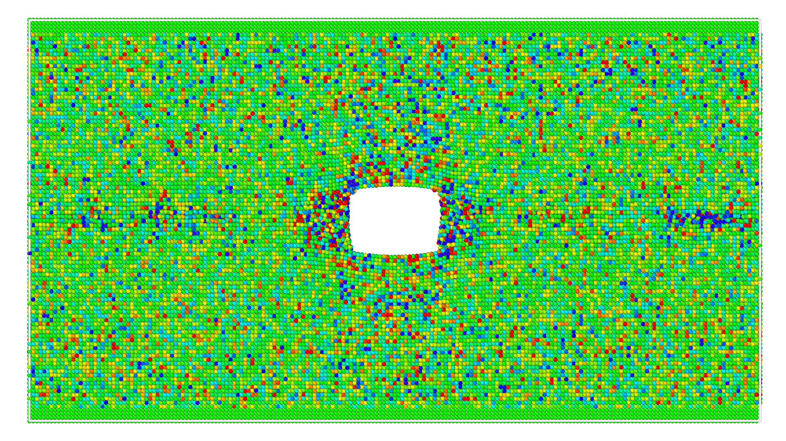
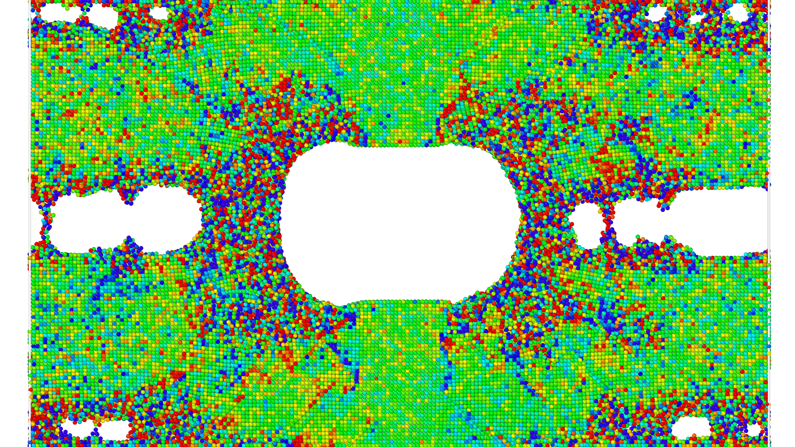
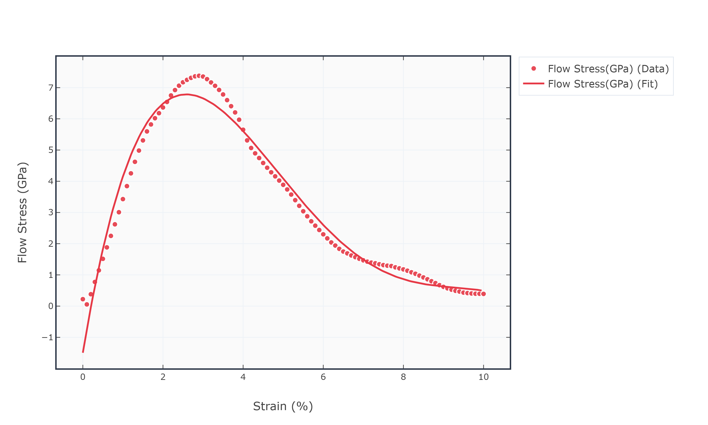

# lammps-aluminum-void-fracture
# 🔬 Molecular Dynamics Simulation of Void Growth in Aluminum under Uniaxial Tension

> **LAMMPS · EAM Potential · 300 K · 10% Strain**  
> Atomistic investigation of crack/void nucleation, growth, and fracture in FCC Aluminum

---

## 📌 Overview

This project presents a molecular dynamics (MD) simulation of **void growth and ductile fracture** in single-crystal Aluminum (FCC) under uniaxial tensile loading using [LAMMPS](https://www.lammps.org/). A pre-existing rectangular void is placed at the center of the simulation box, and the system is strained to 10% while tracking the flow stress response, atomic-scale stress distribution, and void morphology evolution.

---

## 🎬 Simulation Snapshots (Top View — Colored by Atomic Stress)

| Initial State | Stress Concentration | Void Growth | Near Fracture |
|:---:|:---:|:---:|:---:|
|  |  |  |  |
| ε = 0% | ε ≈ 2% | ε ≈ 4–6% | ε ≈ 8–10% |

> Atoms colored by von Mises / per-atom stress (σ_yy). Green = low stress (FCC bulk), Red/Blue = high stress (defect zones).

---

## 📊 Stress–Strain Response



| Property | Value |
|---|---|
| **Peak Flow Stress** | ~7.38 GPa |
| **Strain at Peak** | ~2.9% |
| **Regime after peak** | Void-driven softening & ductile fracture |

The curve shows a classic **elastic → peak → softening** behavior driven by:
1. **Linear hardening** during elastic loading
2. **Stress peak** when void starts expanding rapidly
3. **Post-peak softening** as the void coalesces and necking develops

---

## ⚙️ Simulation Parameters

| Parameter | Value |
|---|---|
| **Software** | LAMMPS |
| **Material** | Aluminum (FCC) |
| **Interatomic Potential** | EAM/Alloy — `Al99.eam.alloy` (Mishin et al.) |
| **Lattice Constant** | 4.05 Å |
| **System Size** | 100 × 50 × 10 unit cells (405 × 202.5 × 40.5 Å) |
| **Void Dimensions** | 10 × 5 unit cells (centered, rectangular) |
| **Temperature** | 300 K (Nosé–Hoover NVT, τ = 0.1 ps) |
| **Timestep** | 1 fs (0.001 ps) |
| **Total Run** | 10,000 steps = 10 ps |
| **Strain Rate** | 0.01 ps⁻¹ (1×10¹⁰ s⁻¹) |
| **Total Strain** | 10% |
| **Boundary Conditions** | Periodic (x, z) · Shrink-wrap (y — loading axis) |
| **Loading Method** | Symmetric constant-velocity boundary displacement |

---

## 📁 Repository Structure

```
├── input_Al.lmp              # Main LAMMPS input script
├── Al99.eam.alloy            # EAM interatomic potential file
├── flow_stress_vs_strain.txt # Raw output: step, strain(%), flow stress(GPa)
├── stress_strain_positive.csv# Processed CSV (positive stress values)
├── convert.py                # Python script to convert raw output → CSV
├── images/
│   ├── top1.png              # OVITO snapshot — initial (ε = 0%)
│   ├── top2.png              # OVITO snapshot — stress concentration
│   ├── top3.png              # OVITO snapshot — void growth
│   ├── top4.png              # OVITO snapshot — necking
│   ├── top5.png              # OVITO snapshot — near fracture
│   └── stress_strain_plot.png
└── videos/
    ├── front.mp4
    ├── left.mp4
    ├── top.mp4
    └── perspective.mp4
```

---

## 🚀 How to Reproduce

### Prerequisites
- [LAMMPS](https://www.lammps.org/) (any recent stable version)
- [OVITO](https://www.ovito.org/) (for visualization)
- Python 3 + pandas (for post-processing)

### Steps

```bash
# 1. Clone the repository
git clone https://github.com/YOUR_USERNAME/lammps-al-void-fracture.git
cd lammps-al-void-fracture

# 2. Run the simulation
lmp -in input_Al.lmp

# 3. Convert output to CSV
python convert.py

# 4. Visualize with OVITO
#    Open crack_Al.dump in OVITO
#    Color atoms by: c_stress_atom[2] (σ_yy component)
```

---

## 🧪 Physics Highlights

- **Void morphology**: The initially rectangular void rounds at the corners as local stress concentrations drive preferential atom removal at the tips.
- **Stress localization**: Bright red/orange rings around the void edges indicate intense deviatoric stress zones — where dislocation nucleation initiates.
- **Secondary void nucleation**: At higher strains (~4–6%), additional voids nucleate near the periodic boundaries and eventually coalesce with the primary void.
- **Ductile fracture mode**: The material undergoes significant plastic deformation before complete separation, consistent with Al's known ductile character.

---

## 🛠️ Tools Used

| Tool | Purpose |
|---|---|
| **LAMMPS** | MD engine |
| **OVITO** | Visualization & per-atom analysis |
| **Python / pandas** | Data post-processing |
| **Matplotlib** | Stress–strain plotting |

---

## 📚 References

1. Mishin, Y. et al., *Interatomic potentials for monoatomic metals from experimental data and ab initio calculations*, Phys. Rev. B 59, 3393 (1999).
2. Plimpton, S., *Fast Parallel Algorithms for Short-Range Molecular Dynamics*, J. Comp. Phys. 117, 1–19 (1995). [LAMMPS paper]

---

## 👤 Author

**[Your Name]**  
[Your Institution / Affiliation]  
[LinkedIn](https://linkedin.com/in/yourprofile) · [Email](mailto:you@example.com)

---

## 📄 License

This project is open-source under the [MIT License](LICENSE).
